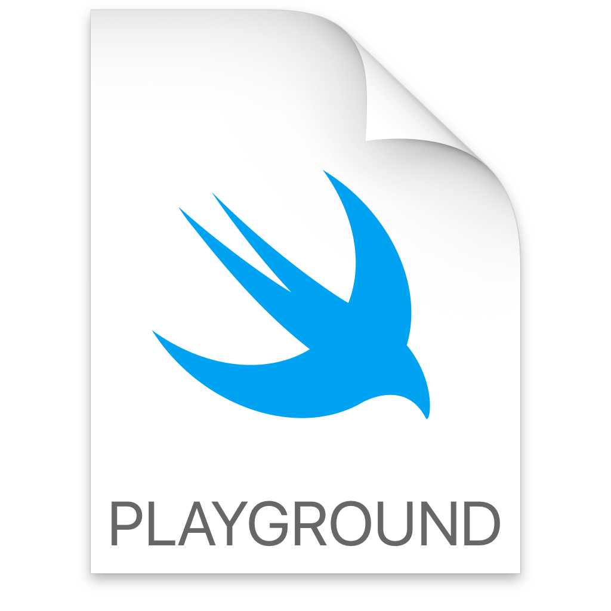
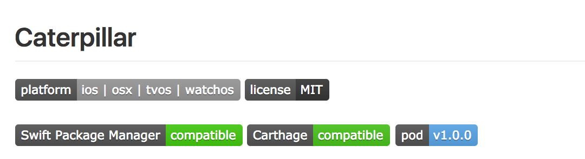

# CocoaHeads CPS

## *Francesco Perrotti-Garcia*

---

#[fit] Caterpillar_: de ideia a publicação_

#[fit] **criando seus próprios frameworks**

---


#[fit] *Francesco* 
#[fit] *Perrotti-Garcia*
#[fit] iOS Developer
#[fit] **_@fpg1503_**

---

#[fit] Frameworks

---

#[fit] >> 🙋🙋‍♂️ <<

---

#[fit] *Usou um*
#[fit] gerenciador
#[fit] de 
#[fit] **dependências?**

---


---


---


---

#[fit] *Publicou*
#[fit] um 
#[fit] **framework?**

---

#[fit] >> 📚 << 

---

#[fit] >> 🐛 << 

---

#[fit] >> 💡 <<

---

#[fit] `dd/mm/yyyy`

---

#[fit] 21/08/2017

---

#[fit] 21/02/2017
#[fit] 21h08

---

#[fit] 21/_02_/2017
#[fit] _21h_08

---

#[fit] `mm`
#[fit] minutos

---

#[fit] `MM`
#[fit] mês

---

#[fit] `yyyy-MM-dd'T'HH:mm:ssZ`

---

#[fit] ISO8601

---

#[fit] >> 🤔 <<

---


---


---

#[fit] Como
#[fit] *descrever*
#[fit] datas

---

#[fit] de maneira
#[fit] *type-safe*
#[fit] e **legível**?

---

#[fit] >> 💡✅ <<

---

#[fit] >> 🎮 <<

---



---

```swift
protocol DateFormatConvertible {
    var dateFormat: String { get }
}
```

---

```swift
struct DateFormat: DateFormatConvertible {
    let dateFormat: String
}
```

---

```swift
extension DateFormatter {
    func setDateFormat(_ dateFormat: DateFormatConvertible) {
        dateFormat = dateFormat.dateFormat
    }
}
```

---

#[fit] Declarativa

---

```swift
public enum YearStyle: String, DateFormatConvertible {
    case noPadding = "y"
    case twoDigits = "yy"
    case fourDigits = "yyyy"

    public var dateFormat: String { return rawValue }
}
```

---

```swift
public struct DateFormat: DateFormatConvertible {
    public let dateFormat: String

    public init() {
        dateFormat = ""
    }

    internal init(format: DateFormatConvertible) {
        dateFormat = format.dateFormat
    }
}
```

---

#[fit] Conveniência

---

```swift
extension String: DateFormatConvertible {
    public var dateFormat: String { return self }
}

public func + (lhs: DateFormatConvertible, rhs: DateFormatConvertible) -> DateFormatConvertible {
    return lhs.dateFormat + rhs.dateFormat
}
```

---

```swift
internal init(formats: [DateFormatConvertible]) {
    dateFormat = formats.reduce("", +).dateFormat
}
```

---

#[fit] Como deixar
#[fit] __bonito__*?*

---

#[fit] >> 💁🏼 <<

---

```swift
public func year(_ style: YearStyle) -> DateFormat {
    return DateFormat(formats: [dateFormat, style])
}
```

---

```swift
let format = DateForrmat()
    .year(.fourDigits)
    .separator(.dash)
    .month(.zeroPaddedNumber)
    .separator(.dash)
    .day(.zeroPaddedNumber)
    .string("T")
    .hour(.zeroPaddedTwentyFourHour)
    .separator(.colon)
    .minute(.zeroPaddedNumber)
    .separator(.colon)
    .second(.zeroPaddedNumber)
    .timezone(.RFC822)
```

---

```swift
let format = DateForrmat()
    .year(.fourDigits)
    .separator(.dash)
    .month(.zeroPaddedNumber)
    .separator(.dash)
    .day(.zeroPaddedNumber)
    .string("T")
    .hour(.zeroPaddedTwentyFourHour)
    .separator(.colon)
    .minute(.zeroPaddedNumber)
    .separator(.colon)
    .second(.zeroPaddedNumber)
    .timezone(.ISO8601)
```

---

#[fit] >> 🎮✅ <<

---

#[fit] >> 📛 <<

---

#[fit]

---

#[fit] Caterpillar

---

#[fit] >> 🐛 << 

---


---

#[fit] >> 📛✅ <<

---

#[fit] >> 📦 <<

---


---

#[fit] `> pod lib create [pod name]` 

--- 

#[fit] **duas** coisas

---

#[fit] >> ✌️ << 

---

#[fit] > `.podspec`
#[fit] > `LICENSE`

---

```ruby
Pod::Spec.new do |s|
 s.name = 'Caterpillar'
 s.version = '1.0.0'
 s.license = { :type => "MIT", :file => "LICENSE" }
 s.summary = '🐛 Caterpillar: Type-safe date formats in Swift, no more yyyy-MM-dd\'T\'HH:mm:ssZ'
 s.homepage = 'https://github.com/fpg1503'
 s.social_media_url = 'https://twitter.com/fpg1503'
 s.authors = { "Francesco Perrotti-Garcia" => "fpg1503@gmail.com" }
 s.source = { :git => "https://github.com/fpg1503/Caterpillar.git", :tag => "v"+s.version.to_s }
 s.platforms     = { :ios => "8.0", :osx => "10.10", :tvos => "9.0", :watchos => "2.0" }
 s.requires_arc = true

 s.default_subspec = "Core"
 s.subspec "Core" do |ss|
     ss.source_files  = "Sources/*.swift"
     ss.framework  = "Foundation"
 end

end
```

---

#[fit] `> pod lib lint`

---

#[fit] `> pod trunk push [NAME].podspec`

---

#[fit] Centralizado

---

#[fit] **des**centralizados

---


---

#[fit] Because Carthage has
#[fit] no _centralized list_, and
#[fit] no _project specification format_, 
#[fit] **most frameworks**
#[fit] **should build automatically.**


---

#[fit] `share`
#[fit] _seus_
#[fit] `schemes`

---

#[fit] >> 🎩 <<

---

#[fit] dependências
#[fit] *tem*
#[fit] dependências

---

#[fit] `Cartfile`

---


---

#[fit] `Package.swift`
^ manifest

---

#[fit] `import PackageDescription`

---

#[fit] By convention, a package includes
#[fit] any source files located in
#[fit] the `Sources/` directory.

---

```
example-package-playingcard
├── Sources
│   ├── PlayingCard.swift
│   ├── Rank.swift
│   └── Suit.swift
└── Package.swift
```

---

```swift
import PackageDescription

let package = Package(
    name: "Caterpillar",
    dependencies: [],
    exclude: ["Tests"]
)
```

---

#[fit] >> 📦✅ <<

---

#[fit] >> 🚀 <<

---

#[fit] `README.md`

---

- Badges
- Requirements
- Usage
- Installation
- Acknowledgments
- License

---

#[fit] Badges

---



---

#[fit] Requirements

---

```
iOS 8.0+ / Mac OS X 10.10+ / tvOS 9.0+ / watchOS 2.0+
Xcode 8.0+
```

---

#[fit] Usage

---

#[fit] Installation

---

#[fit] Acknowledgments

---

#[fit] License

---

#[fit] Pick a License

---

#[fit] Teste!!

---

#[fit] >> 🔨 <<

---

#[fit] __Crie__
#[fit] um
#[fit] _projeto_

---

#[fit] __Importe__
#[fit] seu
#[fit] _framework_

---

#[fit] Use!

---

#[fit] Visibility

---

#[fit] `open`

---

#[fit] `public`

---

#[fit] `internal`

---

#[fit] `fileprivate`

---

#[fit] `private`

---

#[fit] __Pronto__
#[fit] e
#[fit] _usável_

---

#[fit] 👍👍🏿👍🏻👍🏾👍🏼👍🏽 

---

#[fit] >> 🍒🍰 <<

---

#[fit] Continuous Integration

---

#[fit] `travis-ci`

---

#[fit] `.travis.yml`

---

#[fit] Testes

---

#[fit] Teste!

---

#[fit] >> 🛠🛠🛠 << 

---

#[fit] `public`
#[fit] **deve** ser testada

---

#[fit] Cobertura de teste
#[fit] **deve** ser 100%

---

#[fit] What is
#[fit] **code coverage**?

---

#[fit] Code Coverage

^ In computer science, code coverage is a measure used to describe the degree to which the source code of a program is executed when a particular test suite runs.

---

#[fit] 👍 `fpg1503/GoodCodeTalk`

---

#[fit] Docs

---

#[fit] >> 📖 <<

---

#[fit] >> 🚀✅ <<

---

#[fit] Que **chato**
#[fit] fazer isso sempre

---

#[fit] >> 🍪✂️ <<

---

#[fit] `cookiecutter-swift/FrameworkTemplate`

---

#[fit] 📱📺⌚️🖥

---

#[fit] travis

---

#[fit] cocoapods

---

#[fit] Carthage

---

#[fit] SwiftPM

---

#[fit] playground

---

#[fit] README

---

#[fit] `github.com/fpg1503/MakingFrameworksTalk`

---

#[fit] `github.com/fpg1503/Talks`

---

#[fit] Obrigado!

---

#[fit] >> 🐥 <<

---

#[fit] @fpg1503