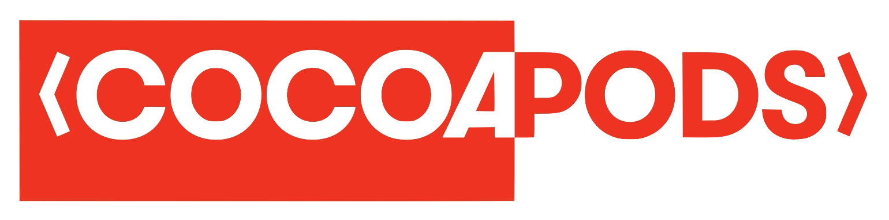
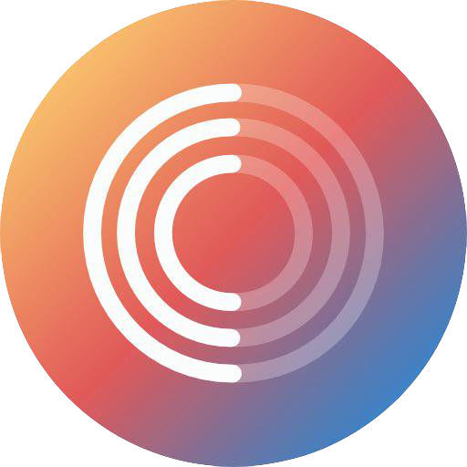
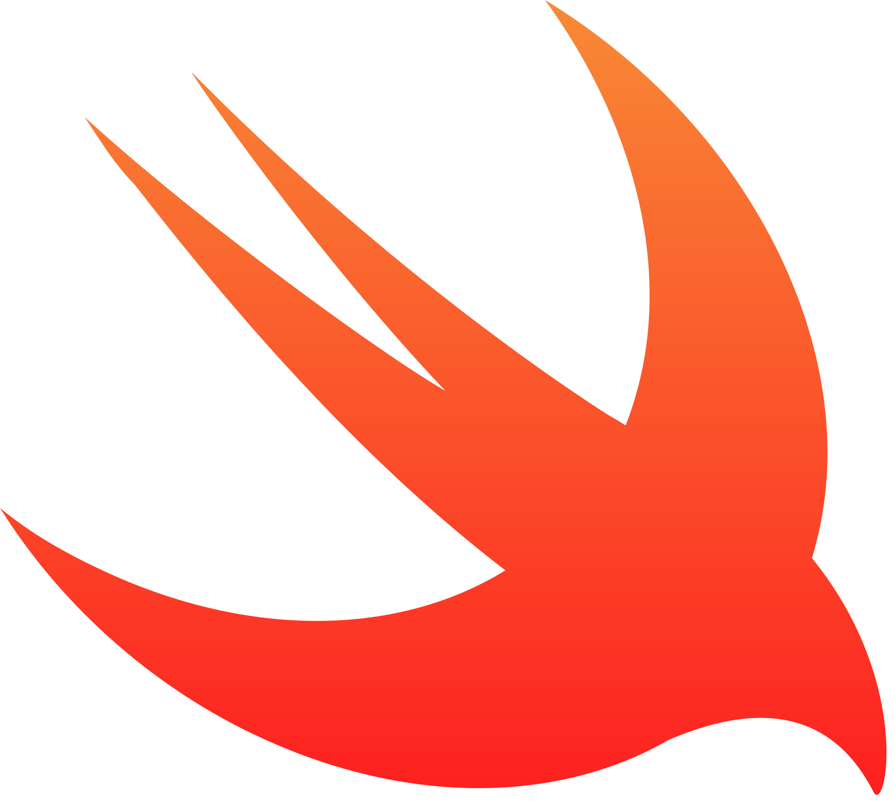
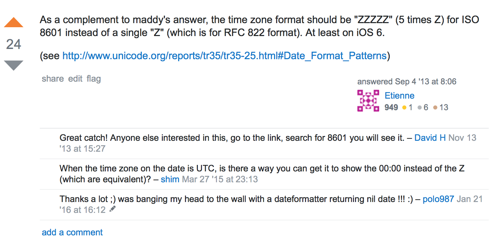
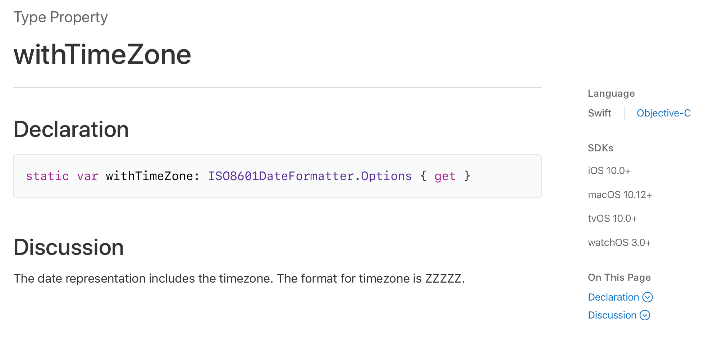
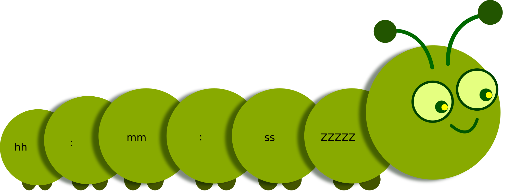

# CocoaHeads CPS

## *Francesco Perrotti-Garcia*

---

#[fit] Caterpillar_: de ideia a publicação_

#[fit] **criando seus próprios frameworks**

---

#[fit] *Francesco* 
#[fit] *Perrotti-Garcia*
#[fit] iOS Developer
#[fit] **_@fpg1503_**

---

#[fit] Frameworks

---

#[fit] >> 🙋🙋‍♂️ <<

---

#[fit] *Usou um*
#[fit] gerenciador
#[fit] de 
#[fit] **dependências?**

---

---

---

---

#[fit] *Publicou*
#[fit] um 
#[fit] **framework?**

---

#[fit] >> 📚 << 

---

#[fit] >> 🐛 << 

---

#[fit] >> 💡 <<

---

#[fit] `dd/mm/yyyy`

---

#[fit] 21/08/2017

---

#[fit] 21/02/2017
#[fit] 21h08

---

#[fit] 21/_02_/2017
#[fit] _21h_08

---

#[fit] `mm`
#[fit] minutos

---

#[fit] `MM`
#[fit] mês

---

#[fit] `yyyy-MM-dd'T'HH:mm:ssZ`

---

---

---

- typesafe
//TODO: Code
- cocoapods
- carthage
- spm
- quality index
- travis
- test
- docs
- readme
- testing
- q&a

---

---

#[fit] `github.com/fpg1503/MakingFrameworksTalk`

---

#[fit] `github.com/fpg1503/Talks`

---

#[fit] Obrigado!

---

#[fit] @fpg1503